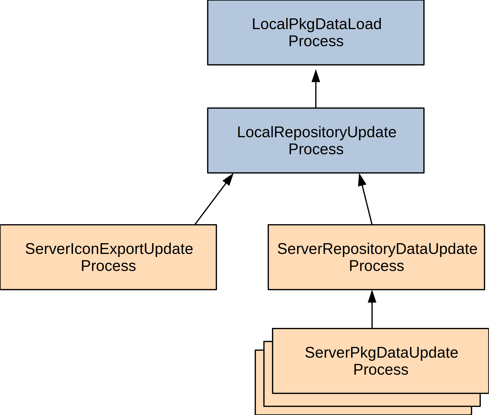
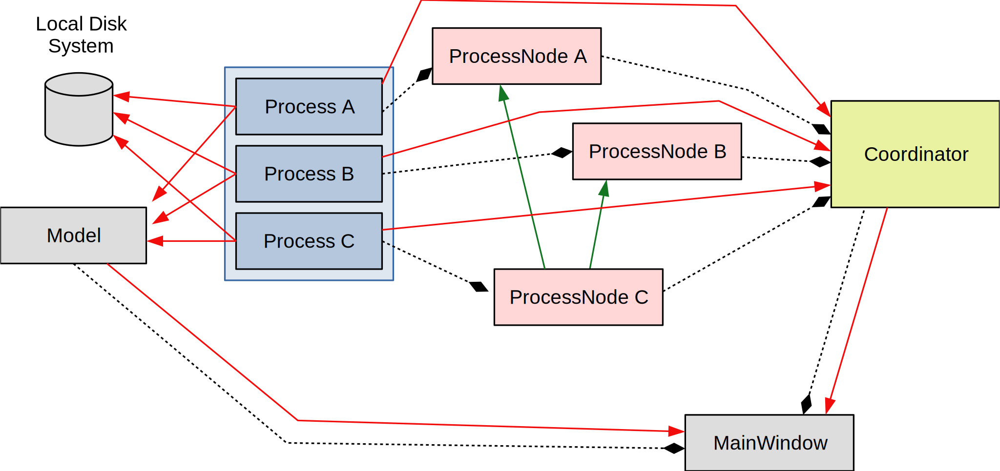

# HaikuDepot and Server Interactions

## Introduction

This document aims to outline the general approach taken within the HaikuDepot application with regard to coordinating processes that relate to fetching and consuming data from remote systems.

There are two main sources of remote data that are downloaded and consumed from network sources into the HaikuDepot desktop application;

* Repository HPKR data from a Haiku mirror such as "HaikuPorts"
* Meta-data related to packages from [HaikuDepotServer](http://depot.haiku-os.org) (HDS) such as icons, localizations, ratings and so on.

## Process, ProcessNode and Coordinator

A _Process_ (root class ```AbstractProcess```) is a class that takes responsibility for some aspect of pulling material down from a network source and processing it.

A _ProcessNode_ is a holder for a Process, but also takes responsibility for the following;

* Maintaining the relationship between the Processes.  For example, if Process A needs to complete before Process B then the ProcessNode would record this fact.  It does this by storing _predecessor_ and _successor_ ProcessNodes.
* Starting the held Process in a newly spawned thread.
* Stopping the held Process.

A _Coordinator_ holds a list of ProcessNodes.  It will start, stop and cancel nodes as necessary such that, in an ideal case, the various ProcessNodes are completed in the correct order.

The _ProcessCoordinatorFactory_ is able to create Coordinators.

## Bulk Load Processes

The following diagram shows the logical dependencies of the various Processes that are involved in refreshing the HPKR data from remote repositories and then loading data from the HDS system.



For example, the ```ServerRepositoryDataUpdateProcess``` must wait until the ```LocalRepositoryUpdateProcess``` has completed before it is able to be started.  It is the reponsibility of the Coordinator to ensure that this sequencing is enforced.  There are many instances of ```ServerPkgDataUpdateProcess``` shown because there will be one launched for each of the Repositories for which data will be downloaded.

## Process / ProcessNode / Coordinator

The following diagram shows the relationship and interplay between the various objects that are involved in running a larger task.  Only fictional Processes are shown to keep the diagram tidy.  See above for the actual Processes.



Dotted lines show associations between elements and red lines show interaction or data-flow.  Green arrows here demonstratively show some dependency; Process C cannot start until A and B are completed.

The MainWindow owns the Coordinator for the life-span of undertaking some larger task.

Each Process is coupled with a ProcessNode and then the Coordinator has a list of the ProcessNodes-s.  The Processes are generally writing to the local disk system (often with compressed files) to cache data (see ```~/config/cache/HaikuDepot```) and also relay data into the ```Model``` object that maintains state for the HaikuDepot desktop application.

The Processes communicate when they have finished to the Coordinator and it is at these events that the Coordinator is able to introspect the state of the Processes in order to know what to do next.

The Coordinator also communicates with MainWindow.  It communicates with the MainWindow in order to signal changes or progress in the overall larger task.  The MainWindow also uses these events to discover when the Coordinator has completely finished.

## Failure

A Process may fail or be stopped.  If a Process fails or is stopped then successor Processes, or those that would have run after the failed process, are stopped so that they will not run.

The Coordinator will still try to complete any other Processes that could still run or are running already.

Upon the Coordinator completing, the Coordinator will signal to the MainWindow client the change in state and then the MainWindow will be able to identify that the Coordinator has completed, but that something has gone wrong along the way.

## Concurrency

It is important to note that Processes may run concurrently.  The Processes' are modelled by the Coordinator as a list rather than a tree.  The dependencies are likely to form a tree or web of Processes that dictates the order of execution, but it is also quite possible to have multiple non-intersecting trees or webs such that Processes will execute independently.
